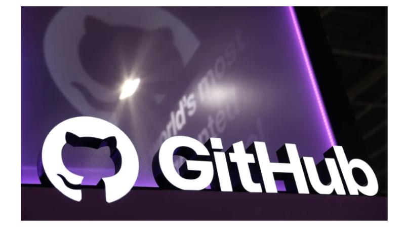
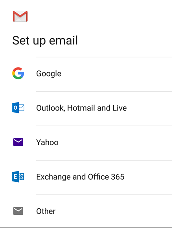
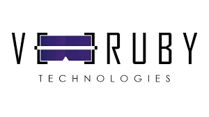

Version v1.2 — Updated September 2025
# Onboarding Learning Path

Welcome to Veeruby’s Learning Path System 🚀  
This guide will help you get started with our culture, tools, and workflows.

---

## 🚀 Start Here (New Interns)
1. **Open your Onboarding Checklist** →  
   https://github.com/Lavanya-D19/Learning-Paths/issues/new?template=onboarding-checklist.yml  
   (This will create your personal issue — update it daily.)
2. **Read:** [Policies (rules, timings, holidays)](Policies.md)
3. **Join Discord** and say hello in `#introductions`
4. **Access tools:** GitHub (this repo), Google Drive, Notion
5. **Pick your path:** [AR](../AR/README.md) / [VR](../VR/README.md) / [AI](../AI/README.md)
6. **Create a Day-1 note** in your checklist issue → “Goals, blockers, next steps”

---

## 📍 Source of Truth
This is the **official onboarding guide**. Always refer here for the latest updates.

- This onboarding guide lives in the [Onboarding folder](./) of our GitHub repo.  
- The **single source of truth** is this file: [README.md](./README.md).  
- Admin update rules are documented in [ADMIN_Update_Process.md](../ADMIN_Update_Process.md).  

> **NOTE:** Always check this README first — it is the latest and only master copy.

---

## 📌 Welcome Message & Vision
Welcome to Veeruby! 🌟  
We’re on a mission to build immersive AR/VR and AI experiences that transform how people learn and interact with technology.  
This onboarding journey will help you understand our culture, our tools, and how we collaborate as one team.

---

## 🏢 Company Overview
Veeruby Technologies is an AR/VR innovation lab focused on creating immersive learning and enterprise solutions.  
- **Who we are** → A passionate team of developers, designers, and innovators.  
- **What we do** → Build AR/VR training, simulations, and AI-powered solutions.  
- **Why we do it** → To help businesses and learners embrace the future of immersive technology.  

🎥 Watch our Company Intro Video: [https://youtu.be/V2iUpk75usk?si=j3K_idRCfJaTEleo](https://youtu.be/FG4xuBNw2po?si=RiMXivgJExAy1OdA)

**Company Links**
- Website: https://veeruby.com  
- LinkedIn: https://in.linkedin.com/company/veeruby  
- YouTube: https://www.youtube.com/@veeruby  

---

## 💫 Culture & How We Work
- **Ownership:** If you see it, you fix it.  
- **Speed > perfection:** Ship small, iterate.  
- **Single source of truth:** This repo first.  
- **Respect time:** Be on time, keep updates crisp.  
- **Help each other:** Ask early, support teammates.  

---

## 🛠️ Tools & Accounts Setup
> **NOTE:** Use your professional/personal email **until** you are issued an official Veeruby email.

1) **Discord (official communication)**
   - Join the Veeruby server (invite from HR).
   - Set display name: `Full Name | Team`.
   - Join: `#announcements`, `#introductions`, `#help`, and your project channel.
   - Enable notifications for @mentions.

2) **GitHub**
   - Share your GitHub username with HR to receive org access.
   - Enable 2FA.
   - Clone project repos you’re assigned to.

3) **Email**
   - Use personal/professional email temporarily.
   - When issued, add your official email to Discord & GitHub.

4) **Notion (project/tasks/wiki)**
   - Accept workspace invite from HR.
   - Open **Onboarding Tasks** and your **Project Board**.

---

## ✉️ Email Guidelines
- Use a **professional tone** and your real name.  
- Use **official purposes only**; keep communications on record.  
- Include a clear subject (e.g., `[Project] Daily Update – 2025-09-08`).  
- Avoid sharing sensitive credentials or tokens over email—use approved channels.

> **NOTE:** Email is for formal communication only. Use Discord for day-to-day chats.

---

## 💬 Communication Guidelines (Discord)
- **Primary tool**: Discord.
- **Channels**:
  - `#announcements` — company-wide updates
  - `#introductions` — post your intro in Week 1
  - `#help` — ask for help early; include screenshots/logs
  - `<project-channel>` — daily async updates
- **Etiquette**:
  - Prefer threads over DMs for project decisions.
  - Share blockers early and tag your lead if urgent.
  - Default timezone: **IST (UTC+5:30)**; expected reply within 4 working hours.

> **NOTE:** If you are stuck, post in `#help` — don’t wait silently.

---

## 📂 Project Access & Workflow Basics
- **Branching**: `main` (protected), use `feat/*`, `fix/*`, `chore/*`.
- **Commits**: follow **Conventional Commits** (feat, fix, docs, chore…).
- **PR checklist**:
  - Clear title & description
  - Screenshots for UI changes
  - Self-review (no debug logs, no secrets)
  - Request a reviewer

> **NOTE:** Never push directly to `main`.

---

## 🎯 Expectations
During your onboarding, please:
- ✅ Complete this Learning Path
- ✅ Set up Discord, GitHub, Email, Notion
- ✅ Join your first project discussion
- ✅ Ask questions when stuck (post in `#help`)
- ✅ Share your intro in `#introductions`
- ✅ Submit a short reflection: *“What did I learn in my first week?”*

### 📅 Week-1 Learning Goals
By the end of Week 1, you should:
- Understand our company vision and culture
- Be familiar with tools and accounts
- Know where to find help
- Be ready to start contributing to a project

---

## ❓ Where to Ask Questions & Get Help
- Discord `#help` channel  
- Your Team Lead / Project Lead  
- Weekly check-ins with your manager

> **NOTE:** Asking early is encouraged. Not asking is the only mistake.

---

## 🧭 Services Overview (AR/VR & AI)
- **AR/VR Training & Simulations** — onboarding sims, safety drills  
- **Anchor-based Remote Support** — guided overlays for field fixes  
- **VR Attractions & Experiences** — location-based entertainment  
- **AI for Ops & CX** — internal copilots, chatbots, analytics automations  

---

## 📚 Tutorials & Reference Materials
**Notion**
- Quick start: https://www.notion.so/help
- Boards & tasks basics: https://www.notion.so/help/guides

**Discord**
- Beginner guide: https://support.discord.com/
- Notifications/how-to: https://support.discord.com/hc/en-us/sections/115000350351

**GitHub**
- Getting Started: https://docs.github.com/en/get-started
- Conventional Commits: https://www.conventionalcommits.org/en/v1.0.0/

**Project Management (Agile)**
- Atlassian guide: https://www.atlassian.com/agile/project-management

**AR Learning**
- Unity Learn (AR): https://learn.unity.com/
- AR Foundation docs: https://docs.unity3d.com/Packages/com.unity.xr.arfoundation@latest
- Vuforia Developer Library: https://library.vuforia.com/

---

## ⏳ Task Prioritization Guide

Managing your tasks well is just as important as completing them.  
Use this guide to decide what to work on first and how to stay on track.

### 🔑 Priority Levels
- **High (🚨 Critical)** → Deadline within 1–2 days, or a blocker for the team.  
- **Medium (⚡ Important)** → Contributes to weekly goals, but not urgent.  
- **Low (🌱 Nice-to-have)** → Long-term or optional improvements.  

### 🗂️ How to Prioritize
1. **Check deadlines first** → Always deliver on time.  
2. **Identify dependencies** → If your task blocks others, finish it first.  
3. **Follow the 80/20 rule** → Focus on tasks that give the most impact.  
4. **Communicate early** → If blocked, raise it in your **Onboarding Checklist Issue**.  

### ✅ Daily Flow
- Start day by reviewing **High-priority tasks**.  
- Allocate ~70% of your time to high/medium, ~30% to learning & improvements.  
- Update your progress in the **Weekly Progress Form**.  

### 📌 Example
- 🚨 **Submit Weekly Progress Form (Friday 5 PM)** → High  
- ⚡ **Research AR tutorial links (due in 3 days)** → Medium  
- 🌱 **Polish README formatting** → Low  

💡 *Tip: Always finish High before Medium, Medium before Low.*

---

## 🗓️ Leave Policy (India) — Max 12 Holidays
- Up to **12 company holidays** per calendar year (Indian calendar).
- HR publishes the official list annually and it **may change** based on company needs.
- Apply in advance via HR/Notion.

> **NOTE:** Max 12 holidays — HR will publish actual dates yearly.

| #  | Holiday Name                | Date (YYYY-MM-DD) | Notes |
|----|-----------------------------|-------------------|-------|
| 1  | Makara Sankranti / Pongal   |                   | Karnataka harvest festival |
| 2  | Republic Day                |                   | National holiday |
| 3  | Maha Shivaratri             |                   | Karnataka temples |
| 4  | Ugadi (Kannada New Year)    |                   | Major Karnataka festival |
| 5  | Eid al-Fitr (Ramzan)        |                   | Community festival |
| 6  | Independence Day            |                   | National holiday |
| 7  | Ganesha Chaturthi           |                   | Hugely celebrated in Karnataka |
| 8  | Gandhi Jayanti              |                   | National holiday |
| 9  | Dasara (Mysore)             |                   | Karnataka’s signature festival |
| 10 | Deepavali / Diwali          |                   | Pan-India, strong in Karnataka |
| 11 | Varamahalakshmi Vrata       |                   | Popular Karnataka festival |
| 12 | Christmas                   |                   | Pan-India festival |

---

## 📸 Setup Screenshots
  
  
  

