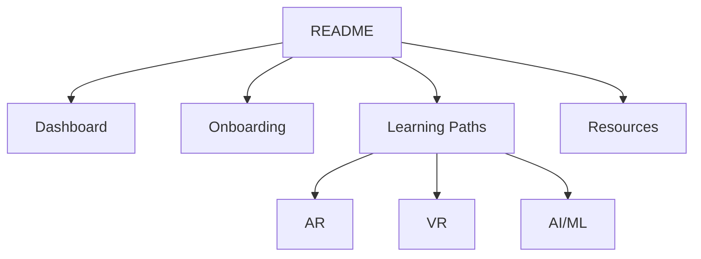

# 🎓 vRuby Learning Paths (LMS)

Welcome to the **vRuby Learning Paths repository**!  
This repo is the **single source of truth** for onboarding, structured training, and learning resources at vRuby.

---

## 🚀 Quick Start
1. Open the **[Dashboard](Dashboard.md)**.  
2. Complete the **[Onboarding Guide](Onboarding/README.md)**.  
3. Pick your **Learning Path**:  
   - [AR Path](AR/README.md)  
   - [VR Path](VR/README.md)  
   - [AI/ML Path](AI/README.md)  

---

## 📚 What’s Inside
- **Onboarding** → Guides, policies, and forms for new interns.  
- **Learning Paths** → AR, VR, and AI/ML roadmaps (12 weeks each).  
- **Resources** → Standards, update logs, and migration notes.  
- **Forms** → Weekly progress, feedback, and quiz submissions.  

---

## 📝 Contribution Guidelines
- All files must be **Markdown-only** (`.md`, `.json`, `.yml`).  
- Follow [Documentation Standards](Documentation-Standards.md).  
- Use meaningful commit messages (e.g., `feat(docs): …`).  

---

## 🔄 Visual Map

