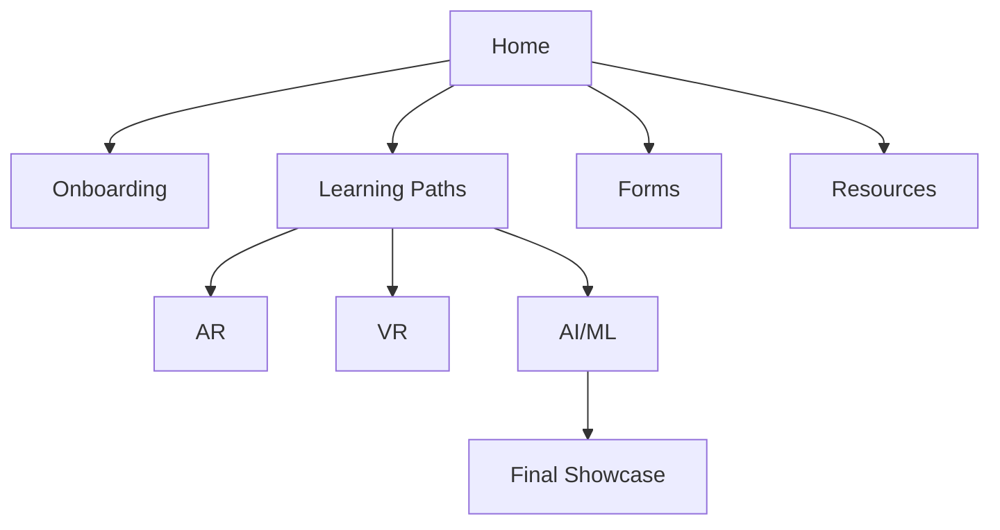

title: "Home"
description: "Welcome to the Markdown-only LMS. Navigate using the sidebar."
last_updated: "2025-09-19"

# Welcome to the LMS

This site is built entirely with Markdown, YAML, and JSON. Use the navigation to explore learning paths, onboarding, resources, and more.
---
title: "vRuby Learning Hub"
description: "Onboarding, learning paths, and weekly submissions."
last_updated: "2025-09-22"
sidebar_label: "Home"
hide_title: false
---

> *Learning for everyone, everywhere.*

---

## 🔎 Explore Learning Paths
| Path | Overview | Duration | Start |
|---|---|---|---|
| 🟦 **AR** | Unity + AR Foundation + Vuforia | 12 weeks | [Open →](AR/README.md) |
| 🟩 **VR** | Unity XR, Interaction, Comfort | 12 weeks | [Open →](VR/README.md) |
| 🟨 **AI/ML** | Python, ML workflows for XR | 12 weeks | [Open →](AI/README.md) |

:::tip Quick Start
1) Open the **[Dashboard](dashboard.md)**  
2) Finish **[Onboarding](Onboarding/README.md)** in Week 1  
3) Post **[Weekly Progress](Forms/Weekly_Progress.md)** every Friday
:::

---

## 🎯 What you’ll achieve
- Build a working **AR demo** and a **VR interaction scene**
- Ship an **AI/ML mini-project** connected to XR
- Publish your **final showcase** with video + README

---

## 📚 Popular Resources
**AR:** Unity Learn (AR) • Vuforia Docs • AR Foundation Guides  
**VR:** Unity XR Plugin • XR Interaction Toolkit • OpenXR  
**AI/ML:** Python • TensorFlow • PyTorch • Kaggle

---

## 🗺️ Visual Roadmap
