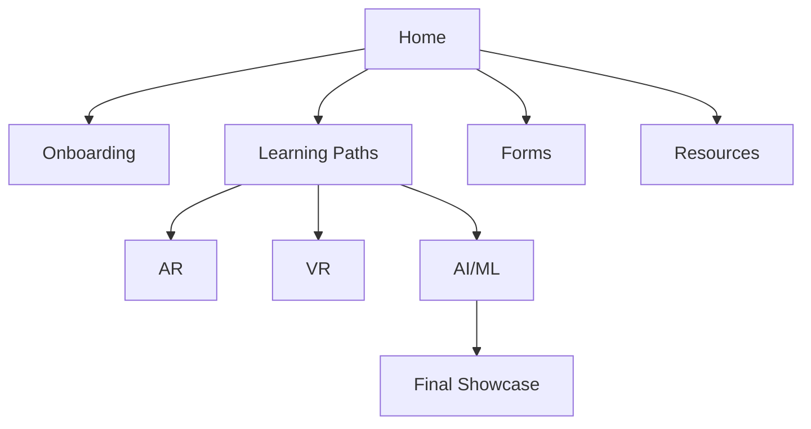

# 🌐 vRuby Learning Hub  
*Learning for everyone, everywhere.*

Welcome to the **vRuby Learning Management System (LMS)** — your single place for onboarding, structured learning paths, and weekly submissions.

---

## 🔎 Explore Learning Paths
- 📱 **[AR Path](AR/README.md)** — AR Foundation & Vuforia, 12-week build.  
- 🥽 **[VR Path](VR/README.md)** — Unity XR, interaction & comfort design.  
- 🤖 **[AI/ML Path](AI/README.md)** — Python, ML workflows, AI for XR.

---

## 🚀 Quick Start
1. Open the **[Dashboard](Dashboard.md)**  
2. Complete **[Onboarding](Onboarding/README.md)**  
3. Submit your first **[Weekly Progress](Forms/Weekly_Progress.md)**

> **Tip:** Finish onboarding in Week 1 to unlock your learning path.

---

## 📚 Popular Resources
| Area | Go-to Links |
|---|---|
| AR | Unity Learn (AR), Vuforia Docs, AR Foundation Guides |
| VR | Unity XR Plugin, XR Interaction Toolkit, OpenXR |
| AI/ML | Python, TensorFlow, PyTorch, Kaggle |

---

## 🗺️ Visual Roadmap

