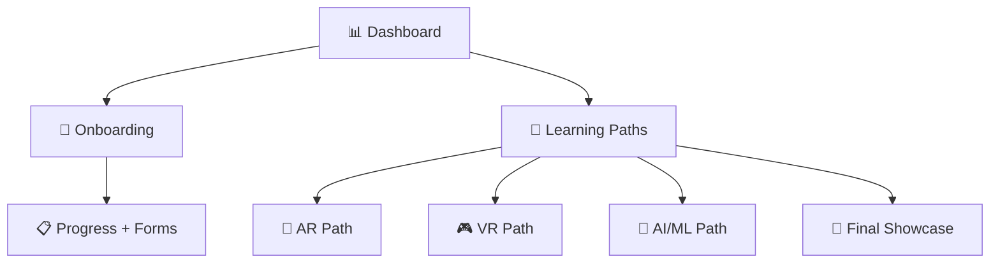

# 🎉 Welcome to vRuby AI Learning

Welcome to the **AI Learning Path**! This guide helps you quickly understand Artificial Intelligence & Machine Learning and gain hands-on experience.  
By the end of this track, you’ll be ready to build, test, and share your own AI projects.

---

## 🚀 Getting Started
1. Read the **AI Introduction**.  
2. Install **Python** + **Jupyter Notebook**.  
3. Run your **first AI model**.  
4. Try a **Hugging Face model**.  
5. Share insights with your mentor.  

---

## 📌 Checklist Overview
✅ Understand AI basics (ML, DL, NLP).  
✅ Install Python & Jupyter Notebook.  
✅ Run sample AI/ML model.  
✅ Explore Hugging Face / OpenAI models.  
✅ Share results with your team.  

---

## 📚 Resources
- [Intro to AI (Beginner Friendly)](https://www.ibm.com/topics/artificial-intelligence)  
- [Jupyter Notebook Guide](https://jupyter.org/)  
- [Hugging Face Models](https://huggingface.co/models)  
- [Python Official Docs](https://docs.python.org/3/)  

---

## 🎯 Outcomes
- Learn core AI/ML concepts.  
- Set up your AI dev environment.  
- Run and test real AI models.  
- Collaborate & share AI insights.

---

## 🔗 Next Steps
➡️ Return to the [Dashboard](../dashboard.md)  
➡️ Continue with the [AR Path](../AR/README.md) or [VR Path](../VR/README.md)

---

# 🗺️ Visual Roadmap

