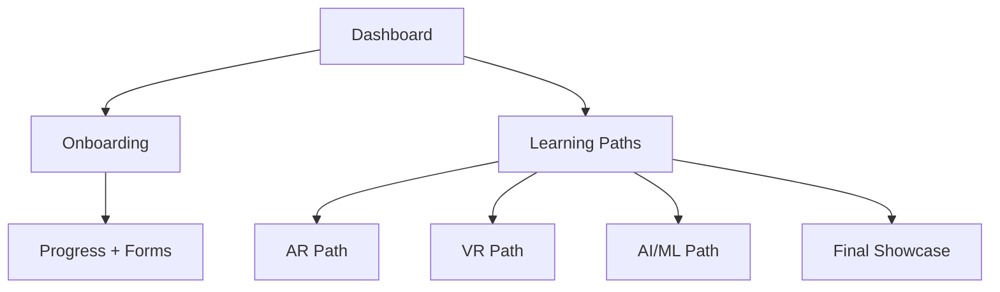

# 🏠 vRuby LMS Dashboard

Welcome! This is the **central hub** for everything you need to get started and grow at **vRuby**.  

Use this dashboard to navigate onboarding, learning paths, and resources.

---

## 🚀 Start Here (New Interns)
- ✅ Open your **[Onboarding Checklist](Onboarding/README.md)**.  
- ✅ Read the **[Onboarding Guide](Onboarding/README.md)**.  
- ✅ Review **[Policies (rules, timings, holidays)](Onboarding/Policies.md)**.  

> **Tip:** Finish onboarding within your first week to unlock your learning path.

---

## 📚 Learning Paths
Choose your track based on your role and interest:

- **[AR Path](AR/README.md)** → Unity, Vuforia, AR projects.  
- **[VR Path](VR/README.md)** → Unity XR, immersive environments.  
- **[AI/ML Path](AI/README.md)** → Python, ML workflows, AI + XR integration.  

---

## 📝 Progress & Submissions
- Submit weekly updates → [Weekly Progress Form](Forms/Weekly_Progress.md).  
- Add project/demo links → [Onboarding Checklist Issue](Onboarding/checklist.md).  
- Final Week 12 → Showcase project in demo session.  

---

## 📂 Resources
- [Documentation Standards](Documentation-Standards.md)  
- [Admin Update Process](admin-update-process.md)  
- [Admin Update Log](admin-update-log.md)  
- [Migration Log](migration-log.md)  

---

## 🔄 Visual Roadmap

