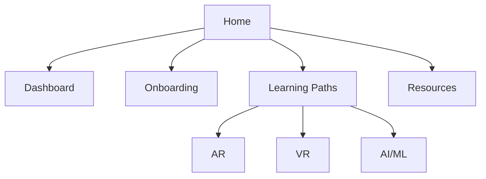

# 🎓 Welcome to the vRuby LMS

The **vRuby Learning Management System (LMS)** is your single source for:  
- Intern **onboarding**  
- Structured **learning paths** in AR, VR, and AI/ML  
- Weekly forms, feedback, and resources  

This site is built to help interns, employees, and collaborators learn efficiently and showcase progress.

---

## 🚀 Quick Start
1. Begin with the [Dashboard](Dashboard.md).  
2. Complete your [Onboarding Guide](Onboarding/README.md).  
3. Choose your learning path:  
   - [AR Path](AR/README.md)  
   - [VR Path](VR/README.md)  
   - [AI/ML Path](AI/README.md)  

---

## 📚 What’s Inside
- **Onboarding** → Checklist, policies, and setup guides.  
- **Learning Paths** → AR, VR, and AI/ML 12-week tracks.  
- **Resources** → Forms, standards, update logs, migration notes.  

---

## 🔄 Visual Roadmap

