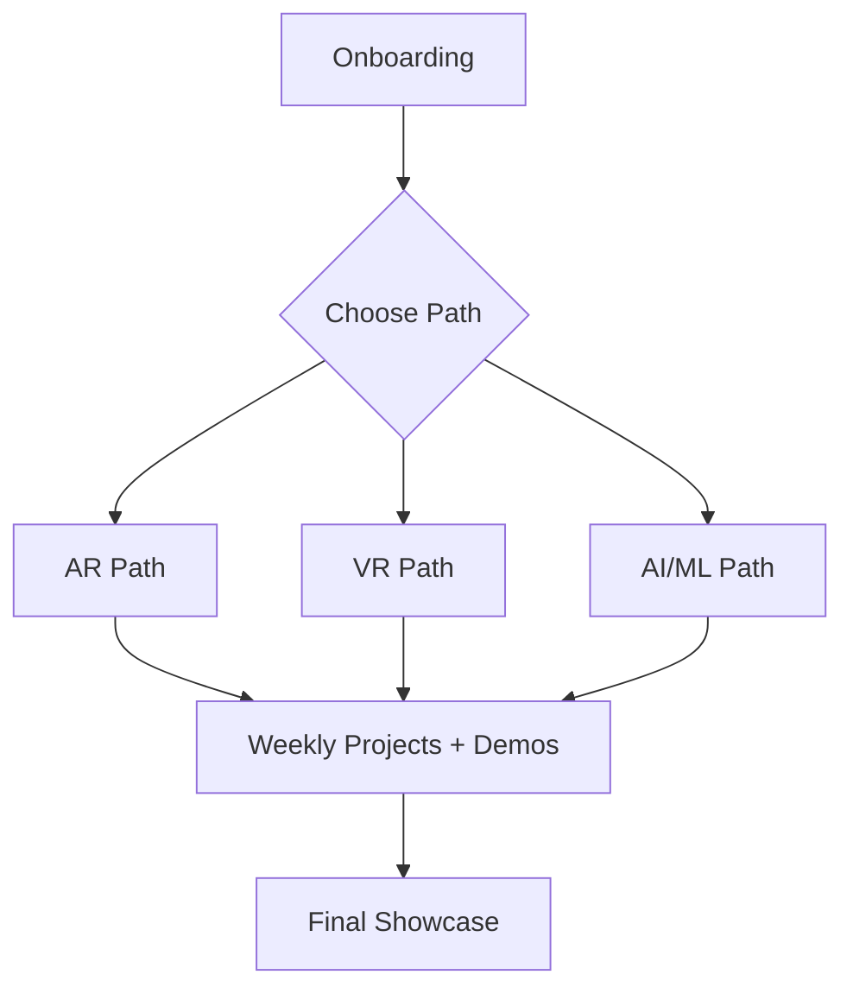

# 📚 Learning Paths Overview

Welcome to the **vRuby Learning Paths** section!  
This space provides **step-by-step roadmaps** for learning **Augmented Reality (AR)**, **Virtual Reality (VR)**, and **Artificial Intelligence / Machine Learning (AI/ML)**.  

Each path is designed to guide interns and new team members from **Beginner → Intermediate → Advanced** within **12 weeks**, combining tutorials, projects, and final showcases.

---

## 🎯 What You’ll Gain
By completing a learning path, you will:
- Build a **solid foundation** in AR, VR, or AI/ML.  
- Engage in **project-based learning** every week.  
- Create a **portfolio of demos and prototypes**.  
- Develop **team collaboration skills** using GitHub workflows.  
- Prepare for **real-world client projects** at vRuby.  

---

## 🛠️ Learning Path Options

### 🔹 AR Path
- **Focus:** AR fundamentals, Unity + Vuforia, image/marker tracking, and interactive AR demos.  
- **Sample Projects:**
  - AR Business Card  
  - AR Product Viewer (3D model placement)  
  - City Guide with AR markers  
- 📖 [Explore AR Curriculum](../AR/README.md)

### 🔹 VR Path
- **Focus:** VR basics, Unity XR SDKs, immersive environments, and VR gameplay design.  
- **Sample Projects:**
  - VR Art Gallery Tour  
  - VR Escape Room  
  - Multiplayer VR Mini-Game  
- 📖 [Explore VR Curriculum](../VR/README.md)

### 🔹 AI/ML Path
- **Focus:** Python, ML workflows, AI-powered XR applications.  
- **Sample Projects:**
  - Image Classifier with TensorFlow  
  - AI Chatbot for VR onboarding  
  - AI-driven AR object recognition  
- 📖 [Explore AI/ML Curriculum](../AI/README.md)

---

## 📅 Structure & Timeline

| Phase            | Duration  | Focus Area                   | Example Milestone                     |
|------------------|-----------|------------------------------|---------------------------------------|
| **Beginner**     | Weeks 1–4 | Fundamentals & setup         | Complete onboarding + first demo      |
| **Intermediate** | Weeks 5–8 | Guided projects & teamwork   | Submit mid-level project              |
| **Advanced**     | Weeks 9–12 | Independent project & showcase | Deliver final demo + presentation     |

---

## 📝 Submissions & Checkpoints
- ✅ **Weekly Progress:** Submit updates in the [Weekly Progress Form](../Forms/Weekly_Progress.md).  
- ✅ **Project Links:** Add demo/project links to your [Onboarding Checklist Issue](../Onboarding/checklist.md).  
- ✅ **Final Showcase:** Share your Week 12 project in the demo session.  

> **Note:** Timely submissions help mentors review your work and give useful feedback.  

---

## 🔗 Related Resources
- [Onboarding Guide](../Onboarding/README.md)  
- [AR Path](../AR/README.md)  
- [VR Path](../VR/README.md)  
- [AI/ML Path](../AI/README.md)  

---

## 🔄 Visual Roadmap

